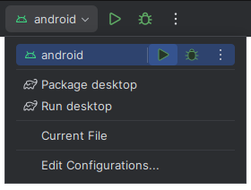

# [Template] KMP Android And Desktop

Kotlin Multiplatform project template with **Android** and **desktop** targets, and **Compose Multiplatform**.

## Versions

Latest update 2024-03-20:

- Kotlin: 1.9.22
- AGP: 8.2.2 
- Gradle: 8.2.1
- JDK: 17
- CMP: 1.6.1 (Jetpack Compose 1.6.3)
- Android SDK: 34

## Build

To build this project, the JDK (Java Development Kit) and the Android SDK are required. 
I recommend using [Intellij IDEA](https://www.jetbrains.com/idea/download) as the IDE, with the **Android**, **Jetpack Compose** and **Compose Multiplatform** plugins installed.

> You can get the **JDK** and **Android SDK** directly from **Intellij IDEA**.

Use run configurations to get started.
  

## Screenshots

|                 Android                 |                      Desktop                      |
|:---------------------------------------:|:-------------------------------------------------:|
|  |                |

## Docs
- [Configure a Gradle project | Kotlin](https://kotlinlang.org/docs/gradle-configure-project.html)
- [Understand Multiplatform project structure | Kotlin](https://kotlinlang.org/docs/multiplatform-discover-project.html)
- [Compose Multiplatform](https://www.jetbrains.com/lp/compose-multiplatform/)

## Examples
- [Compose Multiplatform Examples](https://github.com/JetBrains/compose-multiplatform/tree/master/examples)

## Wizard & Templates
- [Kotlin Multiplatform Wizard ](https://kmp.jetbrains.com/)
- [Kotlin Templates](https://github.com/Kotlin?type=template)