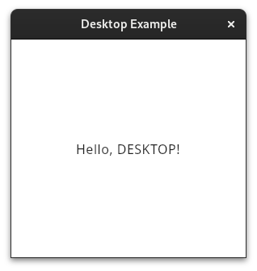

# [Template] KMP Android And Desktop

Kotlin Multiplatform project template with **Android** and **desktop** targets, and **Compose Multiplatform**.

## Versions

Latest combination without errors and warnings (2023-10-07):

- Kotlin: 1.8.10 (compatible with compose compiler 1.4.3)
- AGP: 7.4.0 (compatible with Kotlin Plugin 1.8.10)
- JDK: 17 (supported for AGP 7.4.0)
- Android SDK: 33.0.0 (compatible with AGP 7.4.0)

## Build

Download and install [Intellij IDEA](https://www.jetbrains.com/idea/download).

### Android

1. Configure the JDK (17) and Android SDK.
2. Open the project in Intellij IDEA.
3. Install Android SDK using SDK Setup of IntelliJ (Settings/Languages & Framework/Android SDK).
4. Open and install with `gradlew :android:installDebug`(connected device or emulator required).
5. Or build an apk with `gradlew :android:assembleDebug` (android/build/outputs/apk/debug/android-debug.apk) .

### Desktop

1. Configure the JDK (17).
2. Open the project in Intellij IDEA.
3. Run with `gradlew :desktop:run`.
4. Or package a distribution with `gradlew :desktop:packageDistributionForCurrentOS` (build/compose/binaries).

## Screenshots

| Android                                               | Desktop                                                     |
|-------------------------------------------------------|-------------------------------------------------------------|
|                | 
  
 |
| 
 Android Dialog 
                | 
 Desktop Dialog 
                      |
|  |            |

## Docs
- [Configure a Gradle project | Kotlin](https://kotlinlang.org/docs/gradle-configure-project.html)
- [Understand Multiplatform project structure | Kotlin](https://kotlinlang.org/docs/multiplatform-discover-project.html)
- [Compose Multiplatform](https://www.jetbrains.com/lp/compose-multiplatform/)

## Examples
- [Compose Multiplatform Template](https://github.com/JetBrains/compose-multiplatform-template)
- [Compose Multiplatform Examples](https://github.com/JetBrains/compose-multiplatform/tree/master/examples)